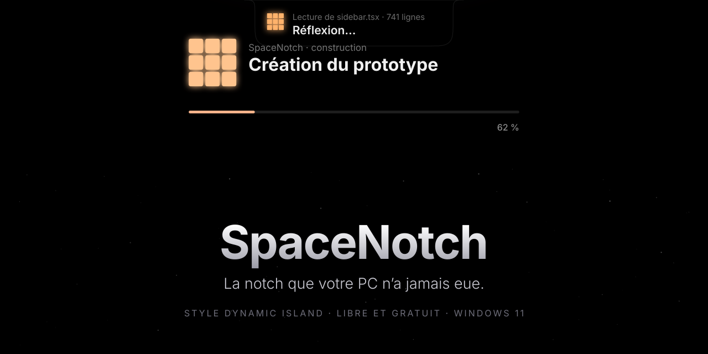
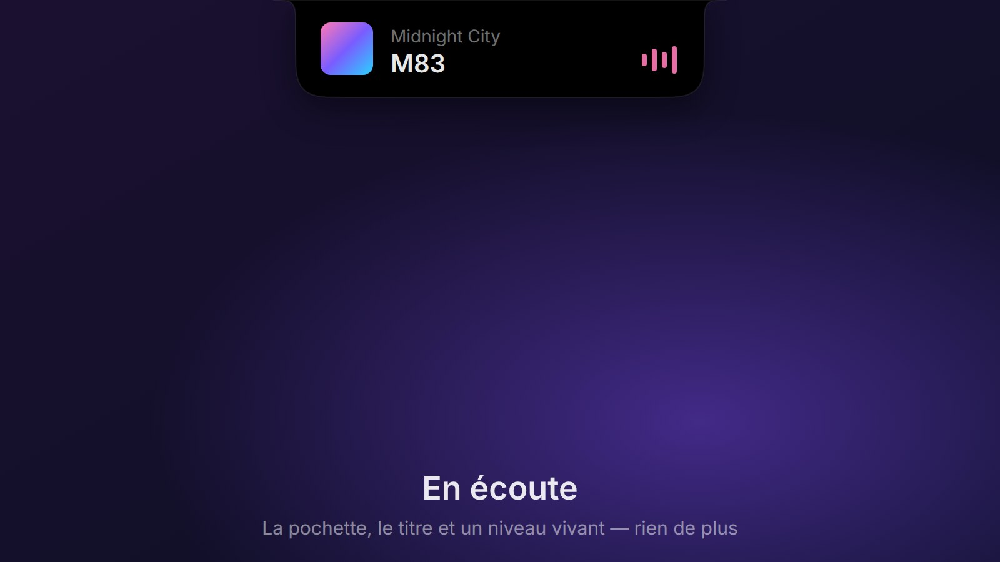
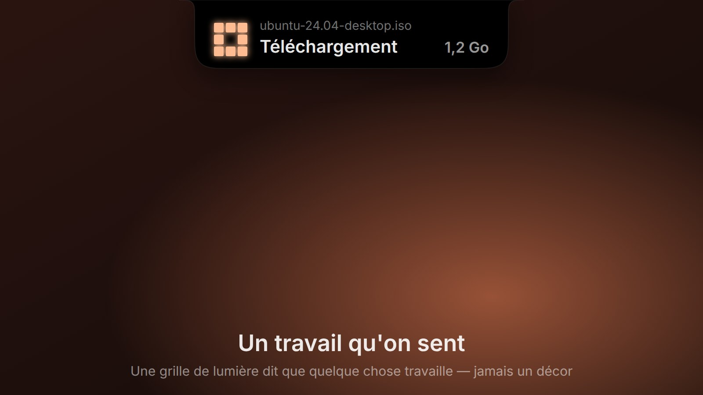
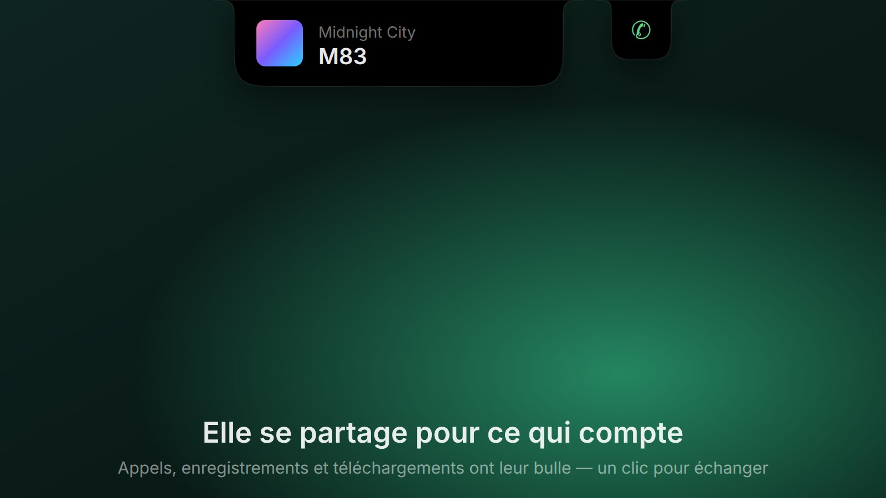
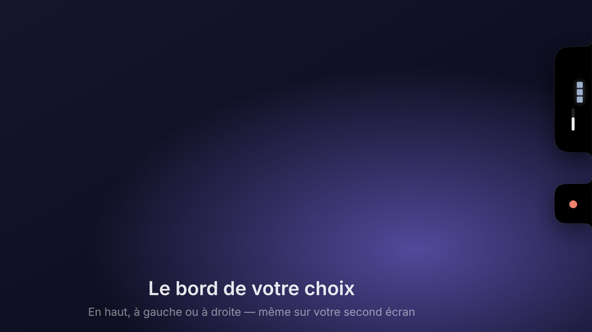
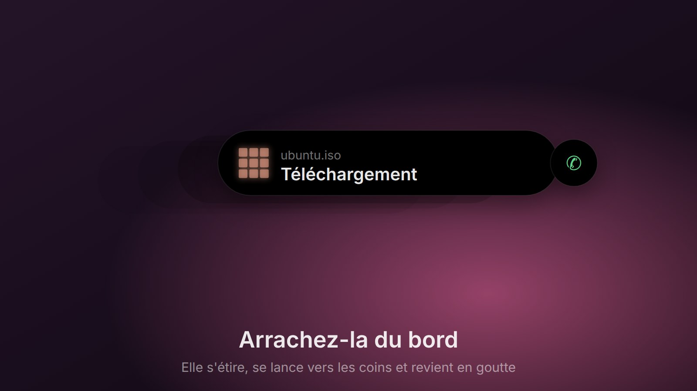
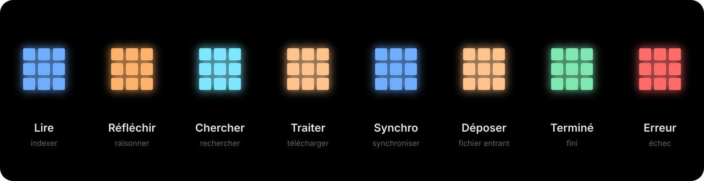
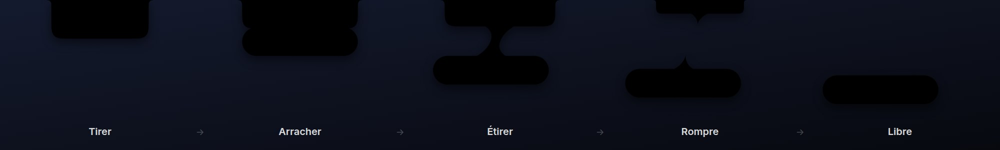

 

  

 

[English](README.md) · **Français**

 

<em>Un petit morceau de nuit en haut de votre écran. 
Il se fait oublier — et s'éveille quand quelque chose mérite votre attention.</em>

 

## Voici votre notch

<table>
  <tr>
    <td width="50%"></td>
    <td width="50%"></td>
  </tr>
  <tr>
    <td width="50%"></td>
    <td width="50%"></td>
  </tr>
  <tr>
    <td width="50%"></td>
    <td width="50%"></td>
  </tr>
</table>

 

## Vivante, jamais agitée

Quand quelque chose travaille — un téléchargement, une recherche, une synchronisation — une petite
grille de lumière respire dans la notch. Chaque travail a son rythme et sa couleur. Quand il est
fini, la lumière se pose en un seul pixel apaisé. Quand rien ne se passe, rien ne bouge.

 

## Arrachez-la du bord

Attrapez la notch et tirez. Elle résiste, s'étire comme une goutte d'encre, puis se détache.
Lancez-la vers un coin, posez-la sur le côté de l'écran, emmenez-la sur votre second écran. Un
double-clic, et elle rentre chez elle.

 

## Faite pour disparaître

<table>
  <tr>
    <td width="33%" valign="top"><h3>Silencieuse</h3>Rien ne tourne quand rien ne se passe. Aucune scrutation, aucune animation de fond — juste une forme immobile en haut de l'écran.</td>
    <td width="33%" valign="top"><h3>Discrète</h3>Elle s'efface quand un jeu ou une vidéo passe en plein écran, et ne s'ouvre jamais pour un simple changement de volume.</td>
    <td width="33%" valign="top"><h3>Privée</h3>Aucun compte, aucune télémétrie, aucun appel réseau. Tout reste sur votre PC.</td>
  </tr>
  <tr>
    <td width="33%" valign="top"><h3>Noir profond</h3>Un noir OLED pur, des épaules douces et concaves, comme si l'écran avait un peu grandi.</td>
    <td width="33%" valign="top"><h3>Douce</h3>Elle respecte le réglage <em>réduire les animations</em> de Windows et parle au Narrateur.</td>
    <td width="33%" valign="top"><h3>À vous</h3>Couleur, transparence, arrondis, bord, sensation du ressort — réglez-la jusqu'à ce qu'elle vous ressemble.</td>
  </tr>
</table>

 

## Ce qu'elle montre

**La musique**, dont la pochette grandit en lecteur · **Le volume et la luminosité**, en surimpression
discrète · **Les téléchargements**, de tous les navigateurs · **Les appels et enregistrements**, d'après
le micro et la caméra · **Les notifications**, groupées par application · **Le Bluetooth** ·
**Minuteur et concentration** · **Un lanceur** pour vos applications · **Une étagère** où glisser des
fichiers · **L'historique du presse-papier** (désactivé par défaut, balayez pour supprimer) ·
**Des greffons** pour tout le reste.

 

## Pour commencer

1. **[Téléchargez SpaceNotch.exe](https://github.com/nicoo-o/SpaceNotch/releases/latest/download/SpaceNotch.exe)** — un seul fichier, rien à installer.
2. Lancez-le. Windows peut dire qu'il *a protégé votre ordinateur* : choisissez **Informations complémentaires › Exécuter quand même** (l'application n'est pas encore signée).
3. Levez les yeux. Survolez la notch pour un aperçu, cliquez pour l'ouvrir, clic droit pour le lanceur.
   Les réglages sont dans l'icône de la zone de notification.

Envie de tout voir ? Lancez `SpaceNotch.exe --demo`.

Windows 11 (23H2 ou plus récent), x64. Vous préférez un dossier ? Prenez <code>SpaceNotch-win-x64.zip</code> dans la <a href="https://github.com/nicoo-o/SpaceNotch/releases/latest">dernière version</a>.

 

## Pour les curieux

SpaceNotch est une application native en C#, sur WinUI 3 et le compositeur de Windows — aucun
moteur de navigateur à l'intérieur. Chaque forme ci-dessus est dessinée par le code géométrique de
l'application, et chaque choix de conception est écrit.

[Vue d'ensemble technique](docs/development/project-overview.md) ·
[Plan de conception](docs/ux/spacenotch-2.0.md) ·
[Décisions](docs/decisions/README.md) ·
[Écrire un greffon](docs/plugin-api.md) ·
[Construire depuis les sources](docs/development/building.md)

 

Inspirée de la Dynamic Island d'Apple et de <a href="https://www.inspora.design/posts/hypnotizing-ui"><em>Hypnotizing UI</em></a> d'Inspora. 
Licence MIT · faite avec soin pour celles et ceux qui aiment un bureau calme.

  

Si SpaceNotch a rendu votre écran un peu plus beau, une ⭐ aide d'autres à la découvrir.

