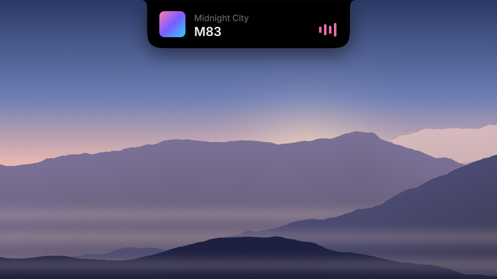
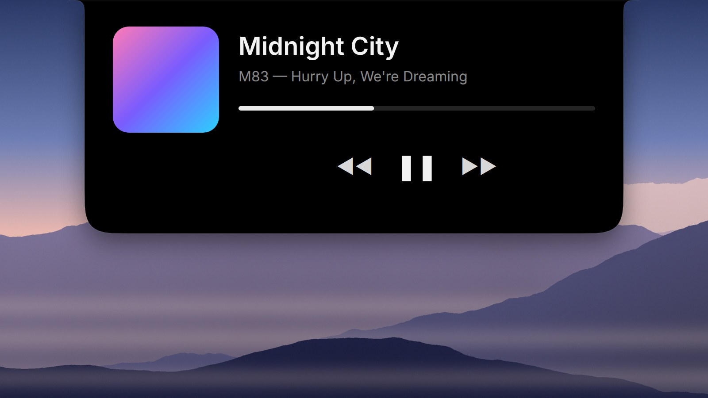
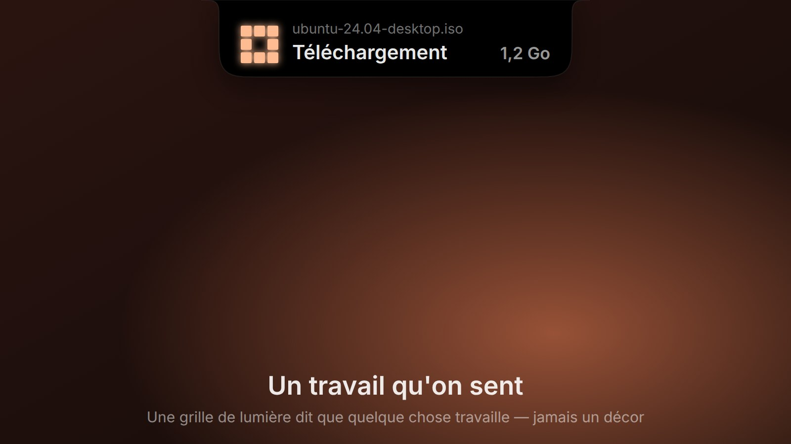
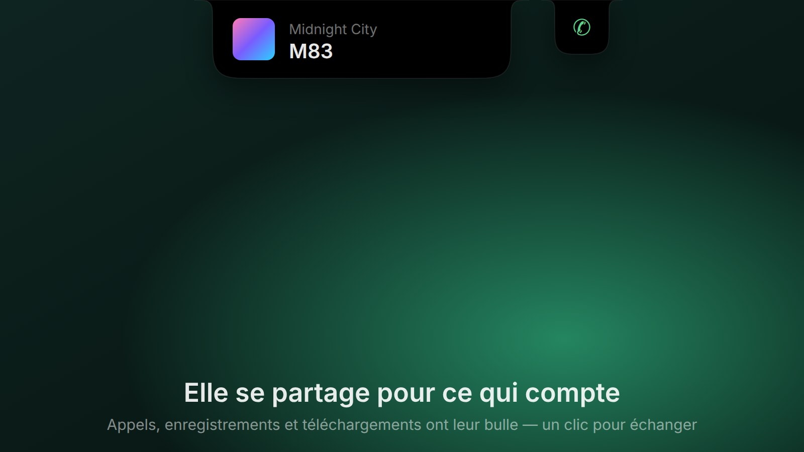
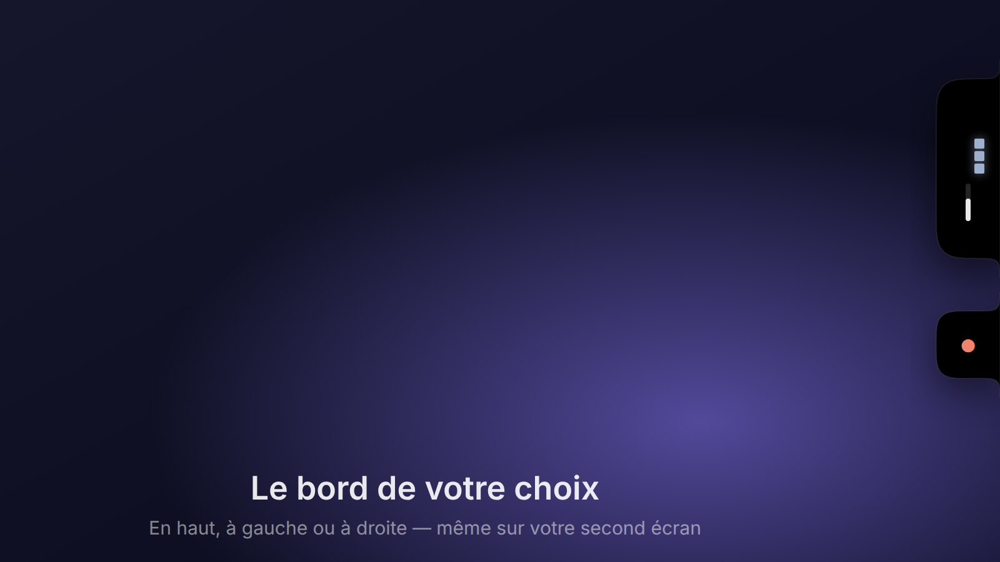
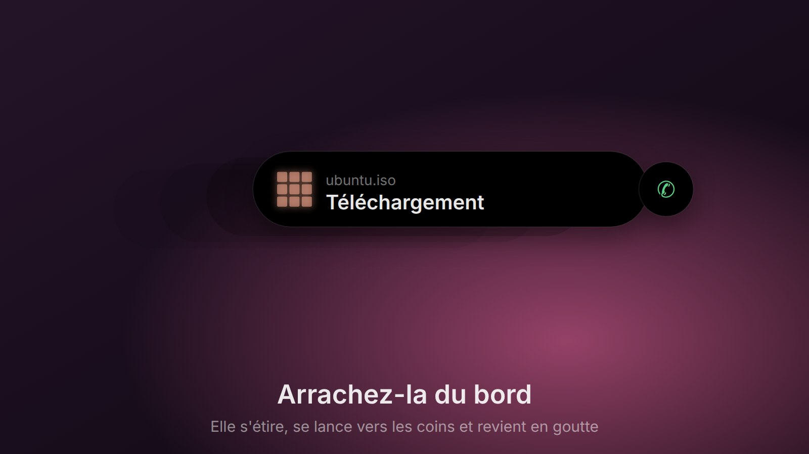
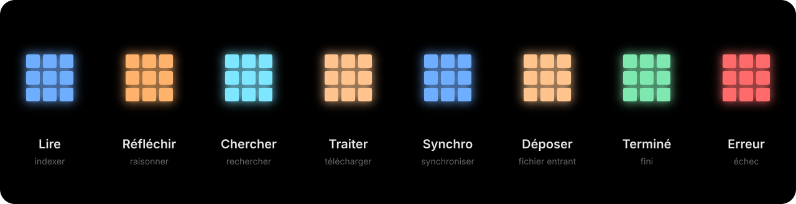
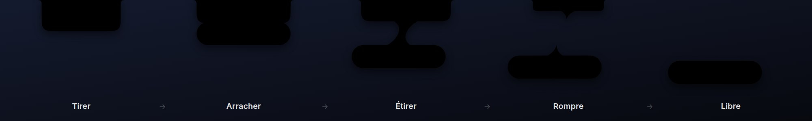

<a href="docs/assets/readme/teaser.mp4">▶&nbsp; Voir avec le son</a>

 

  

 

[English](README.md) · **Français**

 

<em>Un petit morceau de nuit en haut de ton écran. 
Il se fait oublier — et s'éveille quand quelque chose mérite ton attention.</em>

 

## Voici ta notch

<table>
  <tr>
    <td width="50%" valign="top"> <b>En écoute</b> — la pochette, le titre et un niveau vivant, rien de plus</td>
    <td width="50%" valign="top"> <b>Un clic, et elle grandit</b> — la pochette grandit depuis la notch compacte jusqu'au lecteur</td>
  </tr>
  <tr>
    <td width="50%" valign="top"> <b>Un travail qu'on sent</b> — une grille de lumière dit que quelque chose travaille</td>
    <td width="50%" valign="top"> <b>Elle se partage pour ce qui compte</b> — appels, enregistrements et téléchargements ont leur bulle ; un clic pour échanger</td>
  </tr>
  <tr>
    <td width="50%" valign="top"> <b>Le bord de ton choix</b> — en haut, à gauche ou à droite, même sur ton second écran</td>
    <td width="50%" valign="top"> <b>Arrache-la du bord</b> — elle s'étire, se lance vers les coins et revient en goutte</td>
  </tr>
</table>

 

## Vivante, jamais agitée

Quand quelque chose travaille — un téléchargement, une recherche, une synchronisation — une petite
grille de lumière respire dans la notch. Chaque travail a son rythme et sa couleur. Quand il est
fini, la lumière se pose en un seul pixel apaisé. Quand rien ne se passe, rien ne bouge.

 

## Arrache-la du bord

Attrape la notch et tire. Elle résiste, s'étire comme une goutte d'encre, puis se détache.
Lance-la vers un coin, pose-la sur le côté de l'écran, emmène-la sur ton second écran. Un
double-clic, et elle rentre chez elle.

 

## Faite pour disparaître

<table>
  <tr>
    <td width="33%" valign="top"><h3>Silencieuse</h3>Presque rien ne tourne quand rien ne se passe : environ 0,4&nbsp;% d'un cœur au repos (mesuré le 6&nbsp;octobre 2026, Pixel éteint). Seul Pixel, les yeux de la notch, cligne et suit ton curseur.</td>
    <td width="33%" valign="top"><h3>Discrète</h3>Elle s'efface quand un jeu ou une vidéo passe en plein écran, et ne s'ouvre jamais pour un simple changement de volume.</td>
    <td width="33%" valign="top"><h3>Privée</h3>Aucun compte, aucune télémétrie. Par défaut, la seule connexion est la mise à jour depuis GitHub : toutes les 6&nbsp;h, elle vérifie, télécharge et installe la nouvelle version au calme (« Me prévenir » ou « Désactivées » dans les Réglages). La météo, les paroles, Spotify et l'assistant ne se connectent qu'une fois activés. Tout le détail : <a href="PRIVACY.md">PRIVACY.md</a>.</td>
  </tr>
  <tr>
    <td width="33%" valign="top"><h3>Noir profond</h3>Un noir OLED pur, des épaules douces et concaves, comme si l'écran avait un peu grandi.</td>
    <td width="33%" valign="top"><h3>Douce</h3>Elle respecte le réglage <em>réduire les animations</em> de Windows et parle au Narrateur.</td>
    <td width="33%" valign="top"><h3>À toi</h3>Couleur, transparence, arrondis, bord, sensation du ressort — règle-la jusqu'à ce qu'elle te ressemble.</td>
  </tr>
</table>

 

## Ce qu'elle montre

**La musique**, dont la pochette grandit en lecteur · **Le volume et la luminosité**, en surimpression
discrète · **Les téléchargements**, de tous les navigateurs · **Les appels et enregistrements**, d'après
le micro et la caméra · **Les notifications**, groupées par application · **Le Bluetooth** ·
**Minuteur et concentration** · **Une recherche** pour tes applications, les réglages de Windows, tes
fichiers et le calcul rapide · **Une étagère** où glisser des fichiers · **L'historique du presse-papier**
(désactivé par défaut, balaie pour supprimer) · **Pixel**, les yeux de la notch, qui te tient compagnie ·
**Des greffons** pour tout le reste, chargés seulement si tu les approuves.

 

## Pour commencer

1. **[Télécharge SpaceNotch-Setup.exe](https://github.com/nicoo-o/SpaceNotch/releases/latest/download/SpaceNotch-Setup.exe)**.
2. Lance-le. Windows peut dire qu'il *a protégé ton ordinateur* : choisis **Informations complémentaires › Exécuter quand même** (l'application n'est pas encore signée). Si le *Contrôle intelligent des applications* de Windows est actif, il bloque les applications non signées sans proposer de passer outre.
3. L'installeur est la notch elle-même : elle descend du haut de l'écran et s'ouvre sur quelques
   choix — pour toi ou pour tous, lancement au démarrage, raccourci sur le bureau. Appuie sur
   **Installer**, et elle se referme en notch. Windows demande une autorisation d'administrateur, pour
   que SpaceNotch puisse lire tes notifications ; il peut la redemander aux mises à jour. Refuse, et
   tout le reste fonctionne.
4. Lève les yeux. La notch se présente en quelques cartes. Survole-la pour un aperçu ; clique pour la
   recherche et quatre raccourcis (minuteur, presse-papier, note, plus) ; clic droit pour le menu
   rapide ; <kbd>Alt</kbd>+<kbd>Espace</kbd> pour chercher (ou le raccourci affiché dans le menu, s'il
   était déjà pris) ; <kbd>Win</kbd>+<kbd>Alt</kbd>+<kbd>N</kbd> pour l'atteindre au clavier. Les
   réglages sont dans le menu rapide et l'icône de la zone de notification.

Envie de tout voir ? Lance `SpaceNotch.exe --demo`.

Windows 11 (23H2 ou plus récent), x64. Sans installation ? <a href="https://github.com/nicoo-o/SpaceNotch/releases/latest/download/SpaceNotch.exe"><code>SpaceNotch.exe</code></a> se lance tel quel, et <code>SpaceNotch-win-x64.zip</code> est dans la <a href="https://github.com/nicoo-o/SpaceNotch/releases/latest">dernière version</a>. Pour désinstaller : Paramètres › Applications › SpaceNotch.

 

## Inspirations

Les animations de la grille lumineuse — leurs motifs, leurs couleurs, leurs rythmes, et la pluie
binaire — sont inspirées de **[Hypnotizing UI](https://www.inspora.design/posts/hypnotizing-ui)**,
présenté sur Inspora. L'animation d'origine n'est pas de nous : SpaceNotch reprend l'idée pour
Windows et l'applique aux téléchargements, aux recherches, aux synchronisations et à tout travail en
cours.

 

## Pour les curieux

SpaceNotch est une application native en C#, sur WinUI 3 et le compositeur de Windows — aucun
moteur de navigateur à l'intérieur. Chaque forme ci-dessus est dessinée par le code géométrique de
l'application, et chaque choix de conception est écrit.

[Vue d'ensemble technique](docs/development/project-overview.md) ·
[Plan de conception](docs/ux/spacenotch-2.0.md) ·
[Décisions](docs/decisions/README.md) ·
[Écrire un greffon](docs/plugin-api.md) ·
[Construire depuis les sources](docs/development/building.md)

 

Licence MIT · faite avec soin pour celles et ceux qui aiment un bureau calme. 
Le fond d'écran des captures a été créé pour cette page.

  

Si SpaceNotch a rendu ton écran un peu plus beau, une ⭐ aide d'autres à la découvrir. 
Une question, une idée, un souci ? Les <a href="https://github.com/nicoo-o/SpaceNotch/discussions">Discussions</a> et les <a href="https://github.com/nicoo-o/SpaceNotch/issues/new/choose">tickets</a> sont ouverts.

