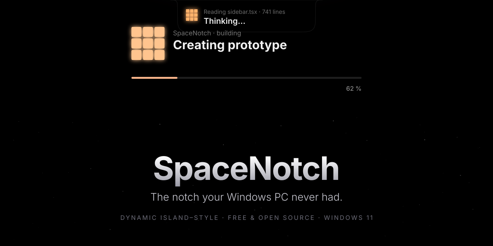
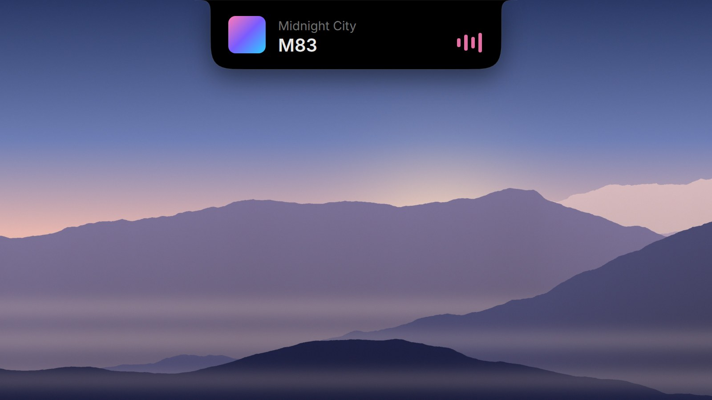
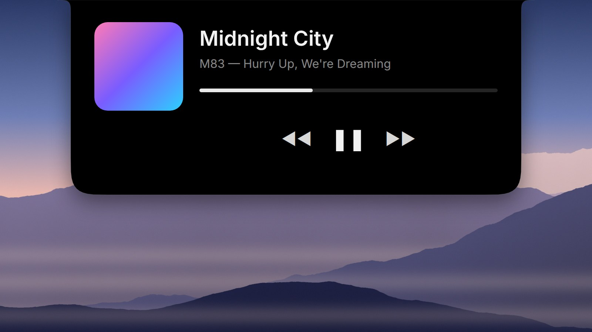
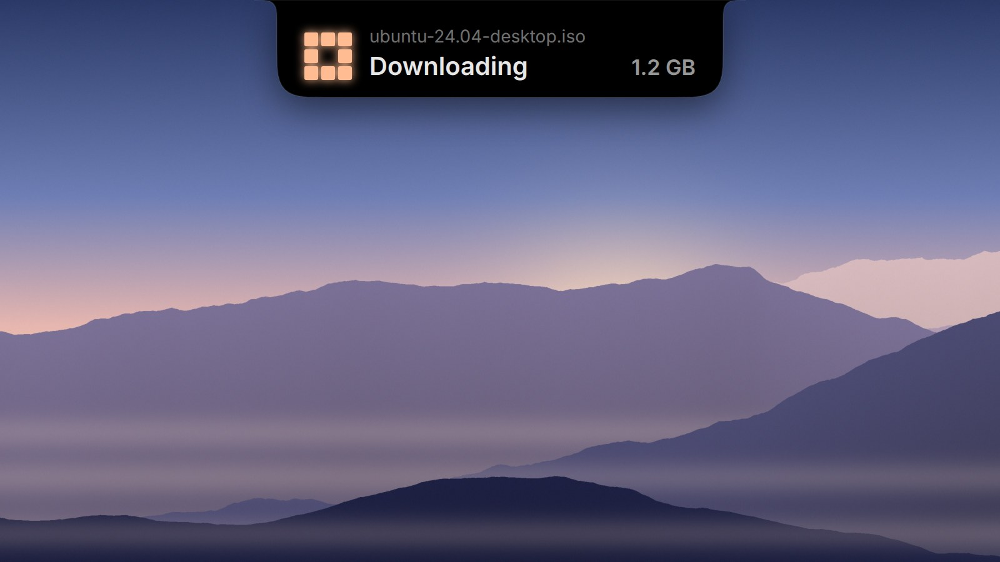
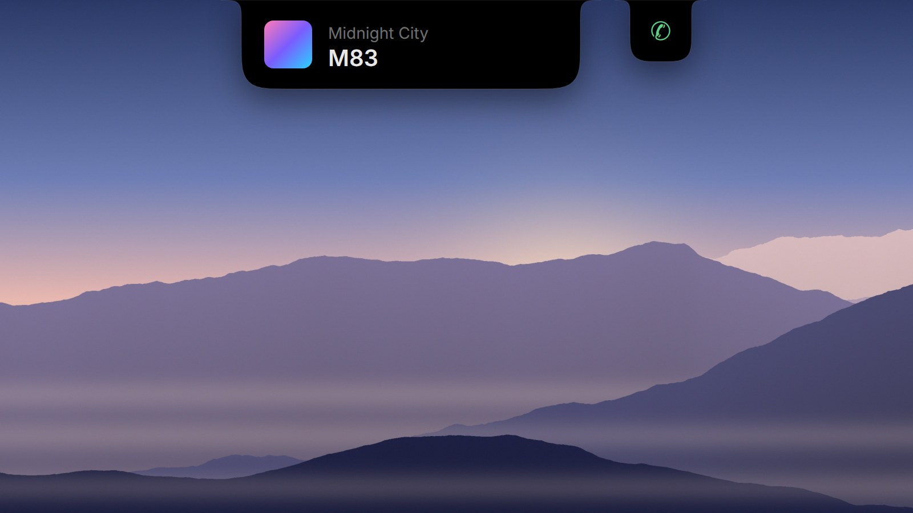
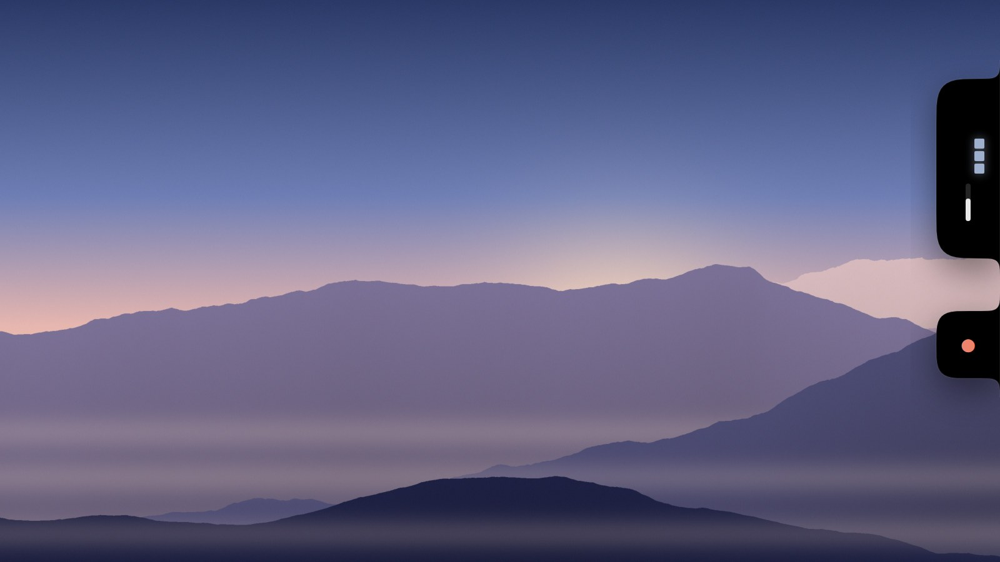
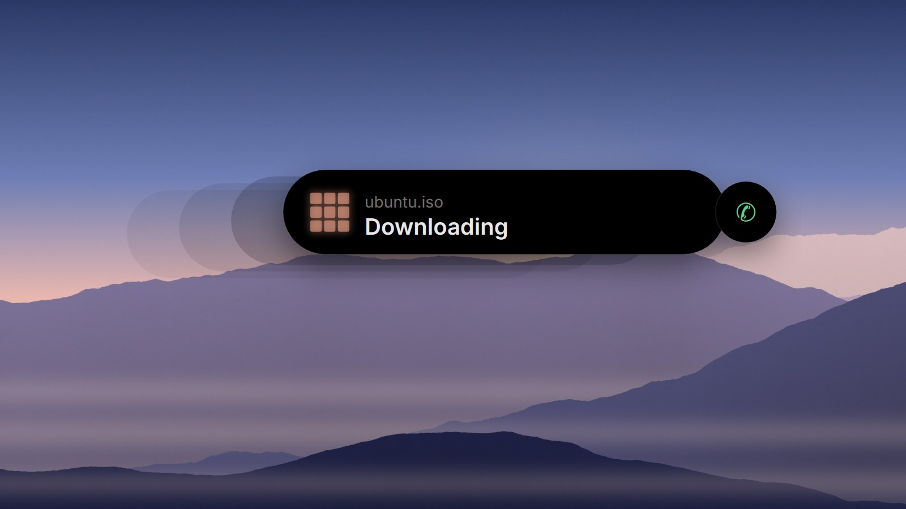
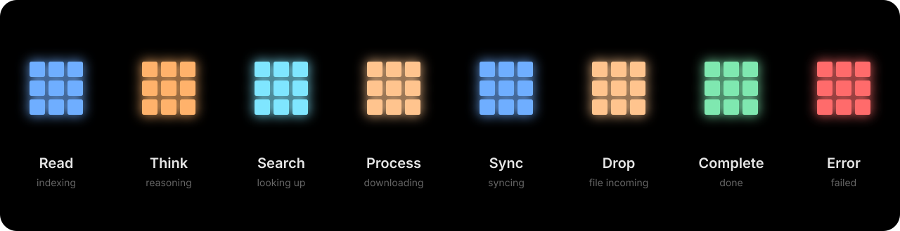
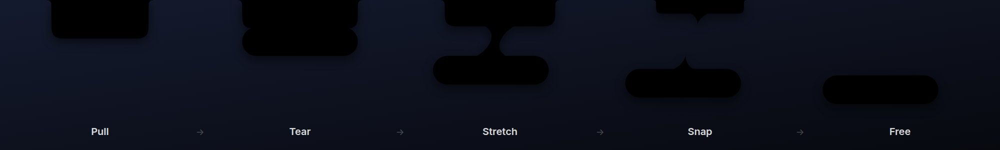

 

  

 

**English** · [Français](README.fr.md)

 

<em>A small piece of darkness at the top of your screen. 
It stays out of the way — and comes alive when something deserves your attention.</em>

 

## Meet your notch

<table>
  <tr>
    <td width="50%" valign="top"> <b>Now playing</b> — artwork, title and a live level, nothing more</td>
    <td width="50%" valign="top"> <b>Click, and it grows</b> — the artwork morphs from the compact notch into the player</td>
  </tr>
  <tr>
    <td width="50%" valign="top"> <b>Work you can feel</b> — a living pixel grid says something is happening</td>
    <td width="50%" valign="top"> <b>It splits for what matters</b> — calls, recordings and downloads get their own bubble; tap to swap</td>
  </tr>
  <tr>
    <td width="50%" valign="top"> <b>Any edge you like</b> — top, left or right, even on your second screen</td>
    <td width="50%" valign="top"> <b>Pull it off the edge</b> — it stretches, throws to corners and snaps back with a drop</td>
  </tr>
</table>

 

## Alive, never busy

When something is working — a download, a search, a sync — a tiny grid of light breathes inside
the notch. Each kind of work has its own rhythm and colour. When it's done, the light settles into
a single calm pixel. When nothing is happening, nothing moves.

 

## Pull it off the edge

Grab the notch and pull. It resists, stretches like a drop of ink, and snaps free. Throw it to a
corner, park it on the side of your screen, carry it to your second monitor. Double-click, and it
flows back home.

 

## Made to disappear

<table>
  <tr>
    <td width="33%" valign="top"><h3>Quiet</h3>Nothing runs when nothing happens. No polling, no background animation — just a still shape at the top of your screen.</td>
    <td width="33%" valign="top"><h3>Respectful</h3>It steps aside when a game or a video goes fullscreen, and never pops open for a volume change.</td>
    <td width="33%" valign="top"><h3>Private</h3>No account, no telemetry, no network calls. Everything stays on your PC.</td>
  </tr>
  <tr>
    <td width="33%" valign="top"><h3>Deep black</h3>Pure OLED black with soft, concave shoulders, as if the screen itself had grown a little.</td>
    <td width="33%" valign="top"><h3>Gentle</h3>Honours Windows' <em>reduced motion</em> setting and speaks to Narrator.</td>
    <td width="33%" valign="top"><h3>Yours</h3>Colour, transparency, curves, edge, spring feel — tune it until it feels right.</td>
  </tr>
</table>

 

## What it shows

**Music** with artwork that grows into a player · **Volume & brightness** as a quiet overlay ·
**Downloads** from any browser · **Calls & recordings** from your mic and camera ·
**Notifications**, grouped by app · **Bluetooth** · **Timer & focus** · **A launcher** for your apps ·
**A shelf** for dragging files in and out · **Clipboard history** (off by default, swipe to delete) ·
**Plugins** for anything else.

 

## Get started

1. **[Download SpaceNotch.exe](https://github.com/nicoo-o/SpaceNotch/releases/latest/download/SpaceNotch.exe)** — one file, nothing to install.
2. Run it. Windows may say it *protected your PC*: choose **More info › Run anyway** (the app isn't code-signed yet).
3. Look up. Hover the notch to peek, click to open, right-click for the launcher.
   Settings live in the tray icon.

Want the full tour? Run `SpaceNotch.exe --demo`.

Windows 11 (23H2 or later), x64. Prefer a folder? Grab <code>SpaceNotch-win-x64.zip</code> from the <a href="https://github.com/nicoo-o/SpaceNotch/releases/latest">latest release</a>.

 

## Inspirations

The glowing pixel-grid animations — their shapes, colours and rhythms, and the falling binary
rain — are inspired by **[Hypnotizing UI](https://www.inspora.design/posts/hypnotizing-ui)**, featured
on Inspora. The original animation is not ours: SpaceNotch rebuilds the idea for Windows and
applies it to downloads, searches, syncs and every other kind of work in progress.

 

## For the curious

SpaceNotch is native C# on WinUI 3 and the Windows compositor — no browser engine inside.
Every shape you see above is drawn by the app's own geometry code, and every design choice is
written down.

[Technical overview](docs/development/project-overview.md) ·
[Design plan](docs/ux/spacenotch-2.0.md) ·
[Decisions](docs/decisions/README.md) ·
[Write a plugin](docs/plugin-api.md) ·
[Build from source](docs/development/building.md)

 

MIT licensed · made with care for people who like their desktop calm. 
The desktop wallpaper in the screenshots was generated for this page.

  

If SpaceNotch made your screen a little nicer, a ⭐ helps others find it.

